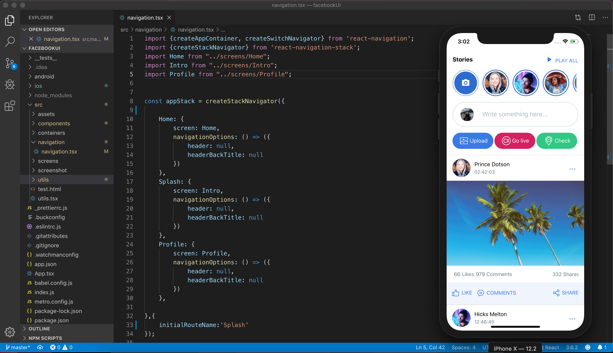

# FacebookUIDesign-React-native
Facebook UI Design made with React-native.
Design found here => https://dribbble.com/shots/4606408-Facebook-Redesign

### Design


##  implementation (Home)


##  implementation (Profile)


### Dependencies

 - React Native (With Typescript)
 - React native elements
 - React Navigation
 
 ## Get Started
 
 #### 1. Clone the Repo
 
 On the command prompt run the following commands
 ```sh
 $ git clone https://github.com/PavelFoujeu/FacebookUIDesign-React-native.git
 
 $ cd facebookUI
 
 $ npm install
 
 $ react-native run-ios
 
 ```

## Author

*	[Pavel Foujeu](mailto:foujeupavel@gmail.com)
